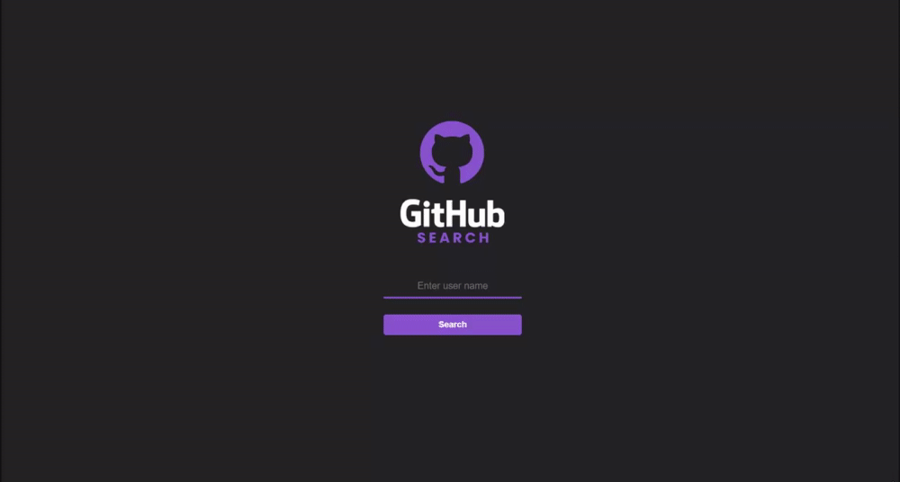

 

    
     
  

## Índice

* [Desafio](#desafio)
* [Techs](#techs)
* [Dicas](#dicas)  
  * [Cores](#cores)
  * [Modelo](#modelo)
  * [Imagens](#imagens)
  * [Icones](#icones)
  * [Tipo de fonte](#tipo-de-fonte)

# Desafio
O desafio é criar um app/site de busca de usuarios e repositorios do github através da sua API! O modelo final está disponível na pasta "design"

## Requisitos:
- A pagina inicial precisa ter um campo de busca, a busca devera ser feita ao clicar no botão de busca ou ao clicar no tecla Enter 
- A resposta da página deverá exibir as informaçes do usuario, tais como nome, followers , following, stars, empresa e localização 
- A resposta da página deverá exibir as informaçes dos repositórios, tais como o nome do repositório, descrição do projeto, stars, forks e um link que direciona para o repositório no Github 

# Techs: 
- Flutter
- Dart
- GetX
- Git

# Dicas

## Documentação API Github (em pt-BR):

<a href="https://docs.github.com/pt/rest/guides/getting-started-with-the-rest-api">Github API</a>

## Cores:
Background: #232324 
Black: #201F1F 
Purple: #8752CC 
Gray: #B2B2B2 

## Modelo:
O modelo final desktop está disponível na pasta `.github` 
Caso prefira, o layout esta disponivel no <a href="https://www.figma.com/file/m5JYqvEa6Zi4zZ7kkfMYJ1/Github-Search?node-id=3%3A28"> Figma </a> 

    
    
    

## Icones
Para os ícones, recomendamos que utilize alguma biblioteca, como o Font Awesome

## Tipo de fonte:
- Roboto

Desafio criado por  <a href="https://www.linkedin.com/in/diego-de-oliveira-brito/">Diego Oliveira</a> :)